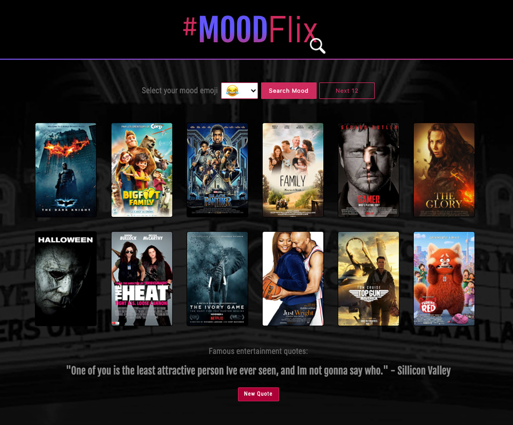

# MoodFlix App
## A Movie For Every Mood!

## Purpose:
Are you tired of Netflix suggesting your random films? Are you looking for a fun interactive way to choose a movie based off your mood? Well, we have the app for you. Welcome to MoodFlix! What is MoodFlix? It's a website that will recommend you movies based off your “MoodMoji”. Are you angry? Click the red angry emoji to see what we’ve got in store for you! Are you looking to laugh out loud? Click on our laughing emoji dropdown menu and see what we’ve got for you!

 

     

 

## Viewable Responsive Screen Sizes:
* Desktop: 1800px
* Media Query Sizes:
  - 980px (Desktop - laptops)
  - 768px (Laptop - tablets)
  - 575px (Small devices - large cell phones)

## Website Link:
https://bjennings90.github.io/Movie-Finder/

## This Website Created Using:
* HTML 
* CSS
* JavaScript 
* (2) Server-side API’s:
  - API’s used for this project: iMDB api and the landOf.Dev movie api
* Materialize CSS 
* GoogleFonts 
* GitHub

## Graphic Software Used:
* Adobe Photoshop
* Adobe Illustrator

## Contribution:
Bethany Duchene-Jennings, Mykaela Saenz and Ron Dronet